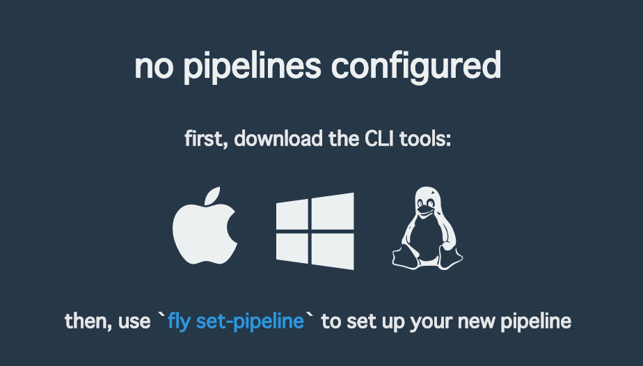
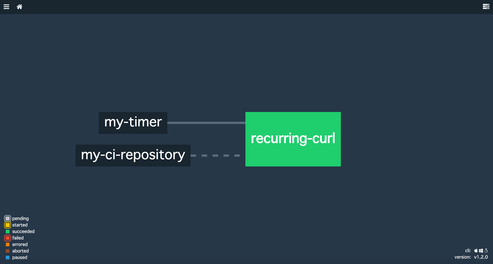

# Concourse CI Hello World

This document shows you how to set your recurring manual tasks to Concourse CI.

After reading it and setting tasks properly, your tedious tasks might be automated by Concourse CI.

## Section

1. [Download `fly` command](https://github.com/takuan-osho/concourse-sample/tree/master/hello-world#download-fly-command)
2. [Login and register target Concourse CI with GitHub OAuth](https://github.com/takuan-osho/concourse-sample/tree/master/hello-world#write-your-pipeline)
3. [Write your pipeline](https://github.com/takuan-osho/concourse-sample/tree/master/hello-world#write-your-pipeline)
4. [Set your pipeline](https://github.com/takuan-osho/concourse-sample/tree/master/hello-world#set-your-pipeline)
5. [Unpause your pipeline](https://github.com/takuan-osho/concourse-sample/tree/master/hello-world#unpause-your-pipeline)
6. [Suppliments](https://github.com/takuan-osho/concourse-sample/tree/master/hello-world#suppliments)

## Download `fly` command

Open the URL of your Concourse CI in your browser.



Once the page loads in your browser, click to download the `fly` CLI appropriate for your operating system, make it executable and move into your path.

```bash
sudo chmod 0755 ~/Downloads/fly
sudo mv ~/Downloads/fly /usr/local/bin
```

## Login and register target Concourse CI with GitHub OAuth

```bash
fly --target ci login -c <your Concourse CI URL>
fly -t ci sync
```

If GitHub Authentication of Concourse CI is enabled, your prompt will show something like this.

```bash
navigate to the following URL in your browser:

    http://<your Concourse CI URL>/auth/github

enter token:
```

Open `http://<your Concourse CI URL>/auth/github` in your browser, copy the token shown on the page and enter the token to your prompt.

## Write your pipeline

For example, if you want target Concourse CI to `curl -I https://google.com` every 5 minutes, make some files like this.

```
sample-repository
├── pipeline.yml
├── task_curl.sh
└── task_curl.yml
```

You should do this:

```
sudo chmod 755 task_curl.sh
```

`task_curl.sh` is like this:

```bash
#!/bin/sh

curl -I https://google.com
```

`task_curl.yml` is here.

```yaml
---
platform: linux
image_resource:
  type: docker-image
  source: {repository: tutum/curl}
inputs:
  - name: my-ci-repository
run:
  path: my-ci-repository/task_curl.sh
```

Codes of `pipeline.yml` are here.

```yaml
---
resources:
- name: my-ci-repository
  type: git
  source:
    uri: https://github.com/<your account name>/<your sample repo name>.git

- name: my-timer
  type: time
  source:
    interval: 2m

jobs:
- name: recurring-curl
  serial: true
  plan:
  - get: my-ci-repository
  - get: my-timer
    trigger: true
  - task: hello-world
    file: my-ci-repository/task_curl.yml
```

You should replace `https://github.com/<your account name>/<your sample repo name>.git` with the real URI of your repository.

Then you should do `git init` in `sample-repository`, `git commit` and `git push` to your github repository (`https://github.com/<your account name>/<your sample repo name>.git`).

## Set your pipeline

```bash
fly -t ci set-pipeline -c pipeline.yml -p curl
```

## Unpause your pipeline

```bash
fly -t ci unpause-pipeline -p curl
```

Open your concourse CI page in your browser.



If your page is like above, there are no problem! Workers do `curl -I https://google.com` every 2 minutes repeatedly on your Concourse CI.

## (Optional) Remove your pipeline

If you want to remove your pipeline from your Concourse CI, you should execute `destroy-pipeline` subcommand with `fly`.

```bash
fly -t ci destroy-pipeline -p curl
```

## Suppliments

If you want to know more about Concourse CI, the documentations below are great supporters!

1. [Concourse Tutorial](https://github.com/starkandwayne/concourse-tutorial) by Stark & Wayne
  - [One of the tutorials which the official Concourse CI documentation introduces](https://concourse.ci/tutorials.html).

2. [Official documentation](https://concourse.ci/introduction.html)
3. [パイプラインベースのCI/CDツール Concourse CI入門](https://blog.ik.am/entries/379)
4. [はじめてのConcourse CI](https://blog.ik.am/entries/380)
  - Written in Japanese.
